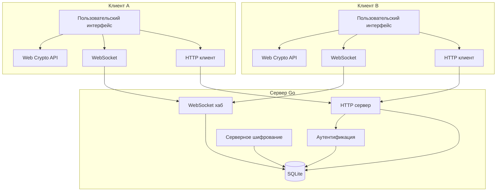

# Архитектура мессенджера: анализ и предложения по улучшению

**Дата анализа:** 2026-03-06  
**Дата обновления:** 2025-01-15  
**Версия документа:** 1.1

## 1. Обзор текущей архитектуры

Проект представляет собой легковесный мессенджер с end‑to‑end шифрованием (E2EE). Серверная часть написана на Go, использует SQLite в качестве базы данных и предоставляет REST API + WebSocket для реального времени. Клиент — одностраничное приложение (SPA) на чистом JavaScript, CSS, HTML.

### Ключевые характеристики:
- **Шифрование:** RSA‑OAEP 2048 бит, ключи генерируются на клиенте.
- **Сервер:** Не имеет доступа к закрытым ключам и содержимому сообщений.
- **База данных:** SQLite с таблицами users, messages, sessions.
- **Коммуникация:** HTTP для REST, WebSocket для мгновенных сообщений.
- **Аутентификация:** Сессионные токены (Bearer).

## 2. Диаграмма архитектуры (улучшенная)



### 2.1 Клиентская архитектура (мобильные устройства)

```
┌─────────────────────────────────────────┐
│           Мобильный клиент              │
├─────────────────────────────────────────┤
│  UI (CSS Media Queries)                 │
│  ├── Адаптивный layout                  │
│  ├── Swipe навигация                    │
│  └── Touch events                       │
├─────────────────────────────────────────┤
│  JavaScript модули                      │
│  ├── app.js (инициализация, навигация)  │
│  ├── crypto.js (криптография)           │
│  │   ├── Web Crypto API (prefer)        │
│  │   └── Server-side keygen (fallback)  │
│  ├── api.js (REST + WS)                 │
│  └── ui.js (DOM + мобильная навигация)  │
└─────────────────────────────────────────┘
```

## 3. Сильные стороны текущей реализации

1. **End‑to‑end шифрование** — содержимое сообщений недоступно серверу.
2. **Простота развёртывания** — один бинарный файл + SQLite.
3. **Чистая клиентская криптография** — ключи генерируются в браузере, закрытый ключ не покидает устройство.
4. **Реальное время** — WebSocket обеспечивает мгновенную доставку.
5. **Безопасность HTTP** — заголовки CSP, X‑Frame‑Options, X‑Content‑Type‑Options.
6. **Хорошая документация** — Architecture.md детально описывает систему.
7. **Адаптивный UI** — поддержка мобильных устройств с touch/swipe навигацией.
8. **Fallback криптография** — при недоступности Web Crypto API (HTTP) используется серверная генерация ключей.

## 4. Слабые места и риски

### 4.1 Криптография
- **RSA 2048** считается устаревшим для долгосрочной безопасности (рекомендуется 3072+ или ECC).
- **Отсутствие forward secrecy** — один компрометированный ключ позволяет расшифровать все прошлые сообщения.
- **Нет аутентификации сообщений** — только шифрование, без HMAC или подписей.
- **Хранение ключей в localStorage** — уязвимо к XSS.

### 4.2 Масштабируемость
- **SQLite** не предназначен для высоких нагрузок и параллельных записов.
- **In‑memory WebSocket хаб** — не распределён, при перезапуске сервера все соединения теряются.
- **Отсутствие очереди сообщений** — офлайн‑пользователи не получают сообщения до подключения.

### 4.3 Безопасность
- **Нет rate limiting** — возможны брутфорс‑атаки на аутентификацию.
- **Слабая валидация входных данных** — возможны инъекции (хотя используются prepared statements).
- **Нет CSRF защиты** для state‑changing операций (логин/регистрация).
- **Токен в URL WebSocket** — может попасть в логи.

### 4.4 Надёжность
- **Нет механизма повтора доставки** — сообщения могут теряться при сетевых сбоях.
- **Нет подтверждения прочтения**.
- **Нет архивирования/резервного копирования** ключей.

### 4.5 Поддержка нескольких устройств
- **Один ключ на аккаунт** — нет синхронизации между устройствами.

### 4.6 Мобильная поддержка и Web Crypto API
- **Web Crypto API требует HTTPS** — на HTTP сервере (без localhost) `crypto.subtle` недоступен в большинстве браузеров.
- **Ограниченная функциональность при fallback** — при серверной генерации ключей:
  - Закрытый ключ остаётся на сервере
  - Расшифровка входящих сообщений недоступна
  - E2EE работает только для отправки (сервер шифрует публичным ключом получателя)
- **Нет PWA** — нельзя установить на домашний экран.
- **Нет push-уведомлений** — пользователь должен держать вкладку открытой.
- **Нет офлайн-режима** — приложение не работает без интернета.

### 4.7 UI/UX ограничения
- **Минимальная анимация** — нет плавных переходов между экранами.
- **Нет темной/светлой темы** — только одна цветовая схема.
- **Нет группировки сообщений** — по дате или по времени.

## 5. Предлагаемые улучшения

### 5.1 Криптографические улучшения
1. **Переход на RSA 3072/4096 или ECC (X25519)** для лучшей безопасности и производительности.
2. **Гибридное шифрование** — каждое сообщение шифруется случайным сессионным ключом AES‑GCM, который передаётся зашифрованным RSA.
3. **Добавление HMAC** или Ed25519 подписей для целостности и аутентичности.
4. **Forward secrecy** — сессионные ключи удаляются после расшифровки.
5. **Хранение ключей в IndexedDB** с защитой от XSS (возможно, использовать Web Crypto API secure storage).

### 5.2 Архитектурные улучшения
1. **Замена SQLite на PostgreSQL** для лучшей параллельной работы и надёжности.
2. **Внедрение Redis** для:
   - Распределённого WebSocket хаба (Pub/Sub).
   - Очереди офлайн‑сообщений.
   - Rate limiting.
3. **Добавление message broker** (NATS, RabbitMQ) для асинхронной обработки.
4. **Контейнеризация** (Docker) для упрощения развёртывания.
5. **Load balancing** — несколько экземпляров сервера за балансировщиком.

### 5.3 Безопасность
1. **Rate limiting** по IP и пользователю (например, с помощью `github.com/ulule/limiter`).
2. **Валидация входных данных** (библиотека `go‑playground/validator`).
3. **CSRF токены** для всех POST/PUT/DELETE запросов.
4. **Audit logging** — журналирование критичных событий (логин, отправка сообщений).
5. **HTTPS обязателен** в продакшене (автоматическое перенаправление).

### 5.4 Функциональные улучшения
1. **Подтверждение прочтения** (read receipts).
2. **Индикатор набора текста** (typing indicator).
3. **Удаление сообщений** (эфемерные сообщения).
4. **Вложения файлов** с end‑to‑end шифрованием.
5. **Голосовые/видеозвонки** (WebRTC).

### 5.5 Надёжность и мониторинг
1. **Health checks** (`/health` endpoint).
2. **Метрики Prometheus** для мониторинга активности.
3. **Автоматические тесты** (unit, integration, e2e).
4. **CI/CD пайплайн** (GitHub Actions/GitLab CI).
5. **Резервное копирование базы данных** и ключей (с шифрованием).

### 5.6 Мультиустройственность
1. **Протокол синхронизации ключей** между устройствами (например, Signal's Sesame).
2. **Возможность отзыва устройств**.
3. **Просмотр активных сессий**.

### 5.7 Мобильные улучшения
1. **PWA (Progressive Web App)** — манифест, service worker, установка на домашний экран.
2. **Push-уведомления** — Web Push API для новых сообщений.
3. **Офлайн-режим** — кэширование сообщений в IndexedDB, синхронизация при онлайне.
4. **HTTPS по умолчанию** — для полной поддержки Web Crypto API.
5. **Альтернативное шифрование** — использовать `subtlecrypto` через fallback только для совместимости, но с явным предупреждением.

### 5.8 UI/UX улучшения
1. **Темная/светлая тема** — смена через CSS variables.
2. **Группировка сообщений** — по дате (сегодня, вчера, ранее).
3. **Анимации** — плавные переходы между экранами, анимация отправки.
4. **Звуковые уведомления** — опционально.
5. **Контекстное меню** — удаление/копирование сообщений.

## 6. Дорожная карта внедрения

### Фаза 1 (Низко висящие фрукты)
- [ ] Rate limiting на эндпоинты аутентификации.
- [ ] Увеличение размера RSA ключей до 3072 бит.
- [ ] Хранение приватных ключей в IndexedDB.
- [ ] Добавление HMAC к сообщениям.
- [ ] Health check эндпоинт.
- [ ] Темная/светлая тема.

### Фаза 2 (Мобильная поддержка)
- [ ] PWA манифест и service worker.
- [ ] Push-уведомления (Web Push API).
- [ ] Офлайн-режим (IndexedDB кэш).
- [ ] HTTPS в production (для Web Crypto API).

### Фаза 3 (Улучшения безопасности)
- [ ] Внедрение CSRF защиты.
- [ ] Audit logging.
- [ ] Обязательный HTTPS в продакшене.
- [ ] Валидация входных данных.

### Фаза 4 (Масштабируемость)
- [ ] Миграция с SQLite на PostgreSQL.
- [ ] Внедрение Redis для очередей и WebSocket хаба.
- [ ] Контейнеризация (Dockerfile, docker-compose).

### Фаза 5 (Расширенная функциональность)
- [ ] Подтверждение прочтения.
- [ ] Удаление сообщений.
- [ ] Вложения файлов.
- [ ] Мультиустройственность.

## 7. Технические детали мобильной реализации

### 7.1 Адаптивный дизайн

Текущая реализация использует CSS Media Queries для адаптации:

```css
/* Основные брейкпоинты */
@media (max-width: 768px) { ... }   /* Планшеты и мобильные */
@media (max-width: 400px) { ... }   /* Маленькие экраны */
@media (max-height: 500px) and (max-width: 768px) { ... } /* Landscape */
```

### 7.2 Мобильная навигация

- **Sidebar** — выезжающая панель слева (transform: translateX)
- **Кнопки** — стрелка назад в header, иконка пользователей в чате
- **Swipe** — свайп влево/вправо для переключения между списком и чатом

### 7.3 Web Crypto API Fallback

```javascript
// Проверка доступности
if (!window.crypto || !window.crypto.subtle) {
    useClientCrypto = false;
    // Сервер генерирует ключи, но E2EE ограничен
}

// При отправке
if (!WebMessenger.Crypto.isClientCryptoAvailable()) {
    showError('Шифрование недоступно. Используйте HTTPS или localhost.');
}
```

### 7.4 Ограничения при fallback

| Функция | Клиентская крипто | Серверная крипто |
|---------|-------------------|------------------|
| Генерация ключей | Клиент | Сервер |
| Закрытый ключ | В localStorage | На сервере |
| Отправка | Шифрование клиентом | Сервер шифрует |
| Получение | Расшифровка клиентом | ❌ Недоступно |

## 8. Заключение

Текущая архитектура обеспечивает базовую функциональность безопасного мессенджера, но имеет ряд ограничений по безопасности, масштабируемости и надёжности. Предложенные улучшения позволят превратить проект в промышленное решение, готовое к использованию в production‑среде.

Рекомендуется начать с криптографических улучшений (фаза 1), так как они напрямую влияют на безопасность пользователей, а затем постепенно внедрять остальные изменения.

Для мобильной аудитории критически важен переход на HTTPS, так как без него полноценное E2EE шифрование недоступно.

---
*Документ подготовлен в рамках анализа архитектуры проекта.*  
*Для реализации предложений рекомендуется переключиться в режим Code.*