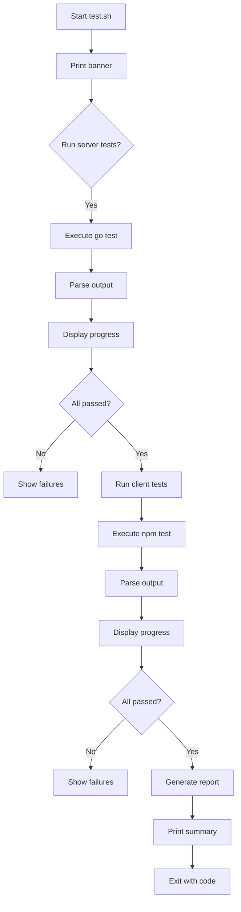

# Test Architecture for Messenger App

## Goals
- Provide full-stack tests (Go server + JavaScript client)
- Beautiful terminal UI with colors, progress bars, and informative output
- Easy to run via `test.sh` script
- Generate coverage reports

## Server Testing (Go)

### Tools
- Standard `testing` package
- `httptest` for HTTP handlers
- `sqlmock` for database mocking (or in-memory SQLite)
- `testify/assert` for assertions (optional)

### Test Structure
- Each Go package (`handlers`, `db`, `crypto`, `models`) will have corresponding `_test.go` files.
- Unit tests for individual functions.
- Integration tests for API endpoints using `httptest`.
- Mock database to avoid persistent state.

### Coverage
- Use `go test -cover` to generate coverage reports.
- Output coverage in HTML format.

## Client Testing (JavaScript)

### Tools
- **Jest** as test runner (supports mocking, coverage, snapshots)
- **jsdom** for DOM simulation
- **Puppeteer** for end-to-end browser tests (optional)

### Test Structure
- Unit tests for modules (`api.js`, `crypto.js`, `ui.js`, `app.js`, `call.js`)
- Integration tests for API interactions (mocking fetch)
- UI component tests using jsdom.
- End-to-end tests with Puppeteer (if time permits).

### Coverage
- Jest built-in coverage with `--coverage` flag.
- Output to `coverage/` directory.

## Test Script (`test.sh`)

### Features
- Colorful output using ANSI escape codes.
- Progress bars for test suites (using simple character animation).
- Real-time output of test results.
- Summary at the end with pass/fail counts and duration.
- Option to start/stop server for integration tests.

### Implementation
- Bash script with functions for printing colored text.
- Use `go test` and `npm test` (or `yarn test`) to run tests.
- Parse output to display progress.
- Use `tput` for terminal capabilities.

### Visualization
```
🧪 Running Server Tests...
[██████████] 100% (5/5) passed
✅ All server tests passed (0.45s)

🧪 Running Client Tests...
[██████░░░░] 60% (3/5) passed
❌ 2 tests failed
```

## Directory Layout

```
Server/
├── handlers/
│   ├── auth.go
│   ├── auth_test.go
│   └── ...
├── db/
│   ├── sqlite.go
│   └── sqlite_test.go
└── ...

Client/
├── js/
│   ├── api.js
│   ├── api.test.js
│   └── ...
├── __tests__/
│   ├── integration.test.js
│   └── e2e/
└── package.json (with jest config)

test.sh (root)
```

## Mermaid Diagram: Test Workflow



## Next Steps
1. Create `test.sh` skeleton with TUI.
2. Implement server tests.
3. Set up Jest for client.
4. Implement client tests.
5. Integrate into script.
6. Verify and refine.

## Questions for User
- Any preferences for assertion library in Go (testify vs standard)?
- Should we include end-to-end browser tests?
- Any specific color scheme for the TUI?
- Should the script be compatible with Windows (via WSL) or only Linux/macOS?